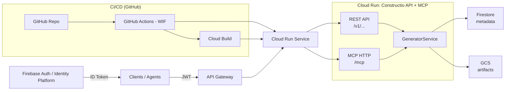

# Constructio API + MCP

Single Cloud Run service that exposes:
- REST API via Connexion (`/v1/...`)
- MCP tools via FastMCP (`/mcp`, routed as `/v1/mcp` through the gateway)

API Gateway sits in front for auth/rate limiting and enforces Firebase JWTs. Firestore stores
metadata and GCS stores artifacts.

CI/CD test trigger.



## Endpoints

REST:
- `GET /v1/generators`
- `POST /v1/generators`
- `GET /v1/generators/{generatorId}`
- `DELETE /v1/generators/{generatorId}`

MCP:
- `POST /mcp` (JSON-RPC) on Cloud Run
- `POST /v1/mcp` (JSON-RPC) via API Gateway

## Local run

Install deps:

```bash
uv sync --extra dev
```

Run the app:

```bash
uv run python src/api/app.py
```

Test MCP tools:

```bash
curl -X POST http://localhost:8080/mcp/ \
  -H "Content-Type: application/json" \
  -H "Accept: application/json" \
  -d '{"jsonrpc":"2.0","id":1,"method":"tools/list"}'
```

Run tests:

```bash
uv run pytest tests/ -v
```

## Configuration

Required for GCP mode:
- `GCS_BUCKET`
- `GCS_PROJECT_ID`
- `FIRESTORE_PROJECT_ID`
- `FIRESTORE_COLLECTION`

Optional:
- `USE_IN_MEMORY_ADAPTERS=true` (local/dev)
- `GCS_UPLOAD_URL_EXPIRY_SECONDS=600`


## Docs

- `docs/architecture.md`
- `docs/deployment.md`
- `docs/cicd.md`
- `docs/service-account.md`
- `src/api/specification.yaml`
